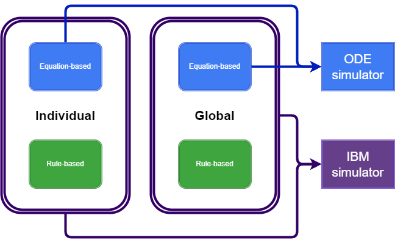

# EcotoxSystems.jl : Simulating component-structured systems for ecotoxicology and chemical risk assessment

## Scope 

This package aims to 

- Provide a systematic approach for modular modelling of mechanistic models in ecotoicology
- Provide a default model and parameters to serve as an entry point for teaching, research and development

Explicitly not within the scope of this package:

- Routines for model fitting
- Providing pre-calibrated/validated models and parameter sets
- Providing an extensive set of pre-implemented models

## Installation 

While `EcotoxSystems.jl` is not registered, install directly from github:

```Julia
using Pkg; Pkg.add("https://github.com/simonhansul/eotoxsystems.jl")
```

## Quickstart

The following code executes the *default* model and parameters. <br>
This is a Dynamic Energy Budget Toxicokinetic-Toxicodynamic (DEB-TKTD) model based on the DEBkiss model developed by Tjalling Jager. <br> 
Inspect `derivatives.jl` to see how this default model is defined. 

```Julia
from EcotoxSystems import params, ODE_simulator
sim = ODE_simulator(params)
```

The ODE system to simulate is a keyword-argument to `ODE_simulator`, and is defined to work with `DifferentialEquations.jl`. <br
> 
So are the functions to generate initial states.
The parameters `p` are a component vector with global (`glb`) and species-level (`spc`) parameters. <br>

Species-level parameters are internally converted to individual-level parameters (`ind`) when passing them onto a simulator.
The function that converts `spc` to `ind` is also a keyword argument of `ODE_simulator`. <br><br>


The following code simulates the default model as individual-based model (IBM):

```
from EcotoxSystems import params, IBM_simulator
sim = IBM_simulator(params)
``` 

We can thus relatively easily switch between both modes. This can be useful for several reasons:

- We can develop and unit-test test the ODE part independently of the rule-based part
- During calibration, we often only need 
- We can more easily re-combine different rules and ODE-systems, respectively, to study model behaviour, perform model selections, Bayesian model averaging, etc.

In essence, the idea that is at the heart of this package is that even the most complex scientific models should be transparent, extensible, testable and maintainable. This is of course an ideal to strive for, and not a destination that we have reached.  <br>

The default model is a DEB-TKTD model, 
but the application of this pacakge is by no means limited to DEB-TKTD models.

## Notes on performance

I suspect that there is some performance trade-off that comes with passing model functions as arguments instead of hard-coding them. In my experience though, the penalty is so far small enough that it doesn't hinder me in any modelling tasks that I did so far with this system (e.g. Bayesian parameter inference, global sensitivity analysis). <br><br>

In the default model, most of the memory allocations and computation times are a.t.m. spent on the TKTD submodel, specifically the broadcasting operations that are needed to allow for an arbitrary number of stressors. A quick performance boost can be achieved by replacing this with a single-stressor TKTD model, hard-coding the number of stressors or eliminiating the TKTD part altogether if it is not needed. <br>


## Implementation logic

The logic of `EcotoxSystems` is based around the notion that a model can be divided into an equation-based portion and a rule-based portion. <br><br>
Furthermore, in the context of models developed for ecotoxicology and ecological risk assessment, 
we need to consider the organism-level as well as the environment (*individual* and *global* in the diagram below). <br>

The equation-based part is a system of ODEs. We exploit [ComponentArrays.jl](https://github.com/jonniedie/ComponentArrays.jl) 
to define parameters and state variables for each component. Components are further sub-divided to an extent that is considered practical, e.g. into a DEB and TKTD component.

