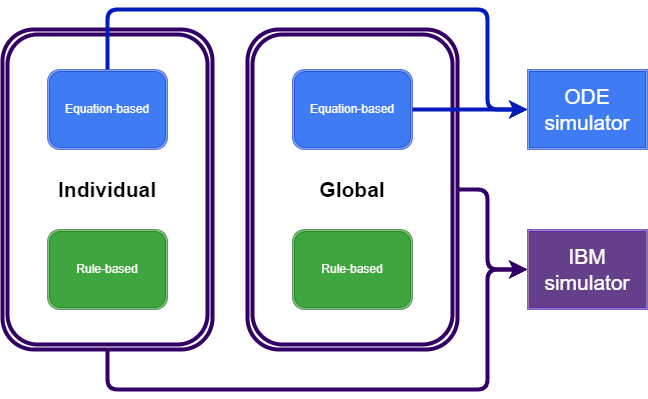

# EcotoxSystems.jl : Simulating component-structured systems for ecotoxicology and chemical risk assessment


[](https://simonhansul.github.io/EcotoxSystems.jl/dev/)
[](https://github.com/SimonHansul/EcotoxSystems.jl/actions/workflows/CI.yml)
[](https://codecov.io/gh/SimonHansul/EcotoxSystems.jl)
[](https://github.com/JuliaTesting/Aqua.jl)

## Scope 

This package aims to 

- Provide a systematic approach for modular modelling of mechanistic models in ecotoxicology
- Facilitate the integration of organism-level ecotoxicological models into individual-based population models
- Provide a default model and parameters to serve as an entry point for teaching, research and development

Explicitly not within the scope of this package:

- Routines for model fitting. These are being developed in [EcotoxModelFitting.jl](https://github.com/simonhansul/ecotoxmodelfitting.jl.git) (work in progress)
- Providing pre-calibrated/validated models and parameter sets. Such things are better out-sourced into independent smaller modules.
- Providing an extensive set of pre-implemented models. Also better done in smaller separate modules, as done for the [AmphiDEB](https://github.com/simonhansul/amphideb) model.

## Implementation logic

The logic of `EcotoxSystems.jl` is based around the notion that a model can be divided into an equation-based portion and a rule-based portion. <br><br>
Furthermore, in the context of models developed for ecotoxicology and ecological risk assessment, 
we need to consider the organism-level as well as the environment (*individual* and *global* in the diagram below). <br>

The equation-based part is a system of ODEs. We make heavy use of [ComponentArrays.jl](https://github.com/jonniedie/ComponentArrays.jl) 
to define parameters and state variables for each component. 



This approach is work in progress, but overall in a functional state. There are currently some limitations regarding performance of the IBM due to type instabilities that occur in the generic IBM scheduling.

## TODO


-[] resolve type instabilities in IBM scheduling
-[] update docs

-[] pre-defined spatial IBMs
-[] native support for multi-species systems


## Installation 

While `EcotoxSystems.jl` is not registered, install directly from github:

```Julia
using Pkg; Pkg.add("https://github.com/simonhansul/ecotoxsystems.jl")
```
or 


```Julia
using Pkg; Pkg.develop(url = "https://github.com/simonhansul/ecotoxsystems.jl")
```


## Changelog 

### v0.1.0

Initial version.

### v0.1.1 

- Added the link_params! function, and link_params as argument of ODE_simulator
- Fixed a typo which caused tests to fail

### v0.1.2 

- Changed the default individual rules to use `S_rel_hist` and `W_S_rel_crit`: If structural mass decreases by a critical relative amount, constant hazard rate kicks in.
- Default callbacks use `save_positions = (false,false)` => time-points of callbacks will not be additionaly saved

### v0.1.3

- `init_global_statevars` and `init_individual_statevars` are now a keyword argument to `IBM_simulator` - necessary to implement modified models with additional states

### v0.1.4

- small bugfixes in IBM_simulator
- small improvements on utils

## v0.2.1

- optimized default model implementation by improving type stability

## v0.2.2

- fixed issue in default TKTD function

## v0.2.3

- `exposure()` can now take a Vector as argument

## v0.3.0

- updated depdendencies
- updated debkiss model implementation to struct-based interface
- updated tests to accomodate new struct-based itnerface 

## v0.3.1

- change in dependency versions
