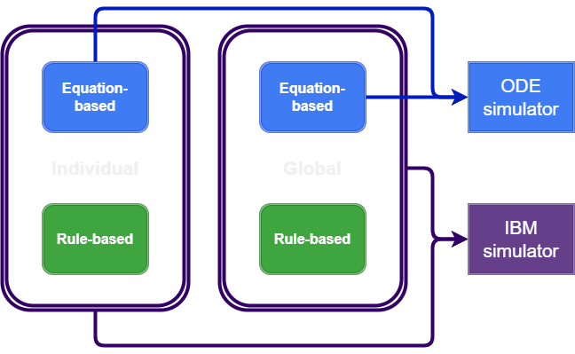

# EcotoxSystems.jl : Simulating component-structured systems for ecotoxicology and chemical risk assessment

[](https://github.com/SimonHansul/EcotoxSystems.jl/actions/workflows/CI.yml)
[](https://codecov.io/gh/SimonHansul/EcotoxSystems.jl)
[](https://github.com/JuliaTesting/Aqua.jl)

## Scope 

This package aims to 

- Provide a systematic approach for modular modelling of mechanistic models in ecotoxicology
- Provide a default model and parameters to serve as an entry point for teaching, research and development

Explicitly not within the scope of this package:

- Routines for model fitting
- Providing pre-calibrated/validated models and parameter sets
- Providing an extensive set of pre-implemented models


## Implementation logic

The logic of `EcotoxSystems.jl` is based around the notion that a model can be divided into an equation-based portion and a rule-based portion. <br><br>
Furthermore, in the context of models developed for ecotoxicology and ecological risk assessment, 
we need to consider the organism-level as well as the environment (*individual* and *global* in the diagram below). <br>

The equation-based part is a system of ODEs. We make heavy use of [ComponentArrays.jl](https://github.com/jonniedie/ComponentArrays.jl) 
to define parameters and state variables for each component. Components are further sub-divided to an extent that is considered practical, e.g. into a DEB and TKTD component.



## Installation 

While `EcotoxSystems.jl` is not registered, install directly from github:

```Julia
using Pkg; Pkg.add("https://github.com/simonhansul/ecotoxsystems.jl")
```


## Quickstart

### Running the ODE simulator

The following code executes the *default* model and parameters. <br>
This is a Dynamic Energy Budget Toxicokinetic-Toxicodynamic (DEB-TKTD) model based on the DEBkiss model developed by Tjalling Jager. <br> 
Inspect `default_derivatives.jl` to see how this default model is defined. 

```Julia
import EcotoxSystems: import defaultparams, ODE_simulator
sim = ODE_simulator(defaultparams)
```

The ODE system to simulate is a keyword-argument to `ODE_simulator`, and is defined to work with `DifferentialEquations.jl`. <br>

So are the functions to generate initial states.
The parameters `p` are a component vector with global (`glb`) and species-level (`spc`) parameters. <br>

Species-level parameters are internally converted to individual-level parameters (`ind`) when passing them onto a simulator.
The function that converts `spc` to `ind` is also a keyword argument of `ODE_simulator`. <br>

### Individual variability

There are some convenience functions, e.g. to run replicated simulations:

```Julia
from EcotoxSystems import defaultparams, ODE_simulator, @replicates
p.spc.Z = Truncated(Normal(1,0.1), 0, Inf) # introduce individual variability through the mass-based zoom factor
sim = @replicates ODE_simulator(defaultparams) 10 # simulate 10 times, each time sampling from Z
```

This is interesting if one of the parameters is subject to individual variability, 
as done for the mass-based zoom factor `Z` in the example above. <br>
Any species-level parameter can be defined as a probability distribution instead of a scalar value, 
and calling `ODE_simulator` on such a parameter set will cause it to take a random sample 
from the distribution to execute the simulation. <br>


### Running the IBM simulator

The following code simulates the default model as individual-based model (IBM):

```
from EcotoxSystems import params, IBM_simulator
sim = IBM_simulator(params)
``` 

We can thus relatively easily switch between both modes. This can be useful for several reasons:

- We can develop and unit-test test the ODE part independently of the rule-based part
- During calibration, we often only need the ODE part.
- We can more easily re-combine different rules and ODE-systems, respectively, to study model behaviour, perform model selections, Bayesian model averaging, etc.

In essence, the idea that is at the heart of this package is that even the most complex scientific models should be transparent, extensible, testable and maintainable. This is of course an ideal to strive for, and not a destination that we have reached.  <br>

The default model is a DEB-TKTD model, 
but the application of this pacakge is by no means limited to DEB-TKTD models.


## Changelog 

### v0.1.0

Initial version.

### v0.1.1 

- Added the link_params! function, and link_params as argument of ODE_simulator
- Fixed a typo which caused tests to fail

### v0.1.2 

- Changed the default individual rules to use `S_rel_hist` and `S_rel_crit`: If structural mass decreases by a critical relative amount, constant hazard rate kicks in.
- Default callbacks use `save_positions = (false,false)` => time-points of callbacks will not be additionaly saved