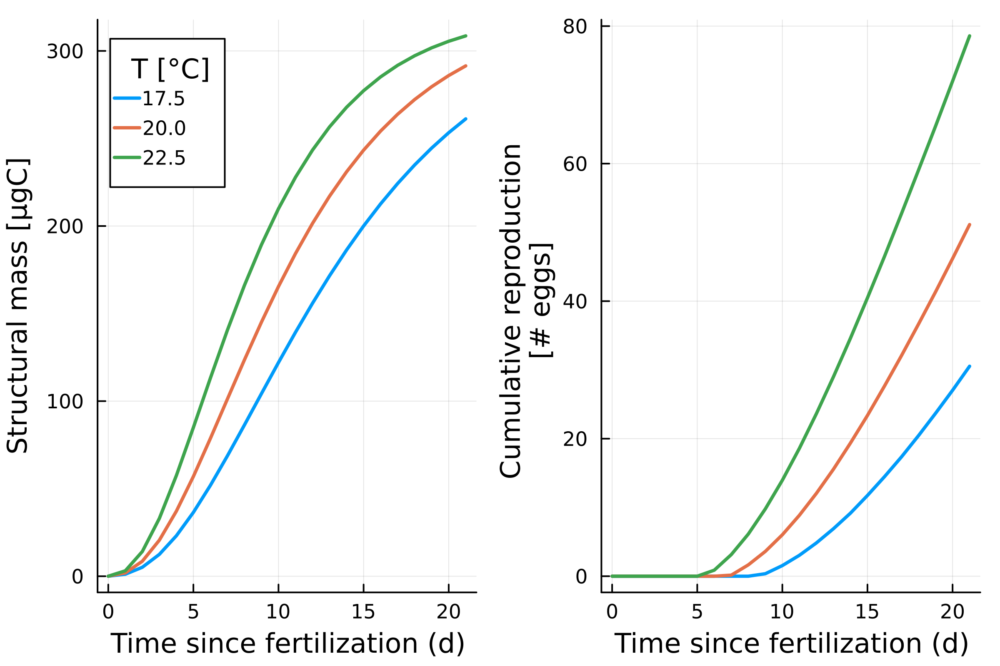

 
# Summary

The responses of organisms and populations to environmental stressors are the outcome 
of complex interactions within organisms, between organisms and with the environment, 
which can be unravelled and possibly predicted with dynamic models.
To understand and predict the effects of chemicals in the environment, 
the application of dynamic models is gaining traction, 
and might become the default approach. 
The package `EcotoxSystems.jl` provides a basis to simulate the effects of chemical mixtures and other environmental factors,
such as temperature on isolated individuals as well as in populations. <br>
The package aims to provide a framework to easily translate organism-level models based on ordinary differential equations into individual-based population models.


# Statement of need

## Providing a seamless switch from individual-level to population-level

`EcotoxSystems.jl` is a Julia package to simulate individuals and populations exposed 
to chemcial stressors. 
It defines a system of ordinary differential equations (ODE) which can be simulated directly 
using efficient solvers provided by `OrdinaryDiffEq.jl`, 
or be integrated into an agent-based or individual-based model (IBM).

Performing extrapolations from the individual level to the population level (or higher) often requires to switch between modelling platforms, or to perform 
individual-level simulations in highly specialized agent-based modelling platforms which are not designed for the efficient solving of ODEs. `Ecotoxsystems.jl` is designed to close this gap by providing a common API to simulate the ODE and ABM, as well as data types
to organize and configure the large amounts of parameters which can be necessary in an DEB-ABM. <br>

## Methods 

### Model description 

The package includes a pre-implemented default model. A full description is given in `SI_modeldescription`. <br>
In short `EcotoxSystems.jl` provides a base model which is based on the DEBkiss model (Jager et al., 2013). 
The base model includes a toxicokinetic-toxicodynamic (TKTD) component which allows to 
simulate an arbitrary number of chemical stressors in mixture, assuming combined effects 
to occur via independent action (IA), i.e. multiplication of the relative responses. <br>
The model can be simulated as system of differential equations or agent-based model. <br>

The default IBM makes some simplistic assumptions about aging, reproduction and starvation mortality (see model description and source code for details). 
These assumptions are sufficient to simulate plausible population dynamics, 
but need to be revisited for specific use cases.

### Parameter structures and defaults

The parameter sets for DEB-TKTD models can grow large, especially when dealing with mixtures 
and AMBs.

Parameters are therefore organized in a designated datatype (`AbstractParamCollection`). 
The default parameter collection `Params` contains the entries `glb`, `spc` and `agn`, all of which are `AbstractParams`. <br>
`glb` stands for *global* and contains the global parameters such as simulated timespan, resource input rate and temperature. <br>

`spc` stands for *species* and contains species-specific parameters. 
These are essentially the DEB and TKTD parameters. <br>

Upon initialization of a parameter structure, `glb` and `spc` contain default values, unless 
modified values were given as keyword arguments.

`agn` stands for *agent* and contains agent-specific parameters. These are used to induce individual variability, either in repeated simulations of the ODE or during simulation of population dynamics with the ABM. <br> 
Upon initialization of a parameter structure, `agn` has the value `nothing`. Users typically do not need to interact with `agn` directly, as this field is set internally upon initializaton of an agent.

### Example simulations of the ODE

To run the base model, one can start by initializing the default parameters. <br>

```Julia
using MechanisticEffectModels.DEBODE
p = Params()
sim = DEBODE.simulator(p)
```

This returns a data frame with all state variables over time. <br>
To simulate different environmental scenarios, the `p.glb` is modified. 
The code snippet below simulates five nutrient input rates (`Xdot_in`) and stores all results 
in a single data frame.

``` Julia
using MechanisticEffectModels.DEBODE, DataFrames
p = Params() #
sim = DataFrame()
let Tvec = [17.5, 20., 22.5] # simulate three ambient temperatures
    for T in Tvec
        p.glb.T = 273.15 + T # succesively lower the food input rate
        sim_i = DEBODE.simulator(p) # generate the predidction
        sim_i[!,:T] .= T
        append!(sim, sim_i) #
    end
end
```

The output is visualized in Figure 1.


**Figure 1: Example simulation of the ODE system. Growth and reproduction are simulated at three temperatures for a hypothetical organism, using the default parameters and code provided in the main text.**
 
### Example simulations of the ABM

To take this to the population-level, in principle only need to change the simulator. 
Instead of `DEBODE.simulator`, we call `DEBABM.simulator`. <br>

For simulations of population dynamics we will tpyically want to include individual variability, which is done through the zoom factor `Z` (see model description for details). <br>
In addition, we might want to adjust some global parameters (longer simulation timespan and higher food input rate), by modify the `glb`-entries. <br>
Since the ABM is always stochastic, it is also a good idea to run repeated simulations. This can be done by manually writing a for loop, or with the `@replicates` macro.

```
using MechanisticEffectModels.DEBABM, DataFrames, Distributions

p = Params()
p.glb.t_max = 56 # adjust simulated timespan 
p.spc.Z = Truncated(Normal(1, 0.1), 0, Inf) # induce individual variability 
p.glb.Xdot_in = 25_000 # provide more food 

Tvec = [17.5, 20., 22.5] # simulate these ambient temperatures
sim = DataFrame() # initialize output data frame
for (i,T) in enumerate(Tvec) # iterate over temepratures
    p.glb.T = 273.15 + T # update temperature in Kelvin
    sim_i = @replicates DEBABM.simulator(p) 10 # generate predictions
    sim_i[!,:T] .= p.glb.T # add column indicating temperature
    append!(sims, sim_i) # add result to output data frame
end
```


**Figure 2: Example simulation of the DEB-ABM. Population dynamics of a hypothetical organism are simulated at three temperatures , based on the default parameters. Thin lines represent individual simulations. Thick lines and ribbons show averages and the 5th to 95th percentile, respectively.**

### Discussion & Outlook

In its current form, `EcotoxSystems.jl` provides a ready-to-use platform for DEB-TKTD modelling, which 
can be easily adapted to model the idiosyncracies of specific organisms, rather than the generic 
case presented here. <br>

It is not the goal of `EcotoxSystems.jl` to provide the same range of functionality as for example found in the Matlab tool `DEBtool` (**citation needed**). <br>
However, some additional functions and adaptations are worth considering. 
For example, a minimal TK model is currently hard-coded into the base model. <br>
We will consider to allow for user-adjustable feedbacks within the TK component, as suggested by Jager (2020), as well as adding functions to support time-variable exposure. <br>

In contrast, the dose-response functions for chemical effects are currently not hard-coded, but can be changed through the species parameters. 
We opted for this variant despite a potential loss in performance, because we want to facilitate 
the comparison of dose-response functions when fitting the model to data. 
Future versions might explore ways to allow for flexible definition of dose-response functions 
without sacrificing performance too much. <br>
An explicit spatial component is currently not implemented, and may also be added in future iterations. 
An adequate implementation of space and movement is however highly species-specific, and any generic implementation will therefore resort to a simplistic spatial scenario.
---
title: 'MechanisticEffectModels.jl: A basis for Dynamic Energy Budget modelling in Julia'
tags:
  - Julia
  - ecotoxicology
  - population modelling
authors:
  - name: Simon Hansul
    orcid: 0000-0000-0000-0000
    equal-contrib: false
    affiliation: 1 # (Multiple affiliations must be quoted)
  - name: Andreas Focks
    equal-contrib: false 
    affiliation: 1
affiliations:
 - name: Institute of Mathematics, University Osnabrück, Germany
   index: 1

date: 20 September 2044
bibliography: paper.bib

---
 
# Summary

The responses of organisms and populations to environmental stressors are the outcome 
of complex interactions within organisms, between organisms and with the environment, 
which can be unravelled and possibly predicted with dynamic models.
Dynamic Energy Budget (DEB) theory provides a generic theory 
to model the life history of organisms and their responses to the environment. <br>
To provide a basis for DEB modelling in the Julia language, we developed the package `EcotoxSystems.jl`, 
defining a base model which can be either executed as system of differential equations 
or within an agent-based framework. <br>
This provides a basis to simulate the effects of chemical mixtures and other environmental factors,
such as temperature on isolated individuals as well as in populations. <br>
The base model can be extended to account for physiological idiosyncracies of individual species. <br>


# Statement of need

## Providing a seamless switch from individual-level to population-level

`EcotoxSystems.jl` is a Julia package to simulate individuals and populations exposed 
to chemcial stressors. 
It defines a system of ordinary differential equations (ODE) which can be simulated directly 
using efficient solvers provided by `OrdinaryDiffEq.jl`, 
or be integrated into an agent-based model (ABM).

Performing extrapolations from the individual level to the population level (or higher) often requires to switch between modelling platforms, or to perform 
individual-level simulations in highly specialized agent-based modelling platforms which are not designed for the efficient solving of ODEs. To close this gap, `EcotoxSystems.jl` provides a common API to simulate the ODE and ABM, as well as data types
to organize and configure the large amounts of parameters which can be necessary in an DEB-ABM. <br>

Since parameter inference from data is a common task in DEB-TKTD modelling, `EcotoxSystems.jl` includes an implementation of a likelihood-free Bayesian parameter 
inference algorithm (**citation needed**), which can be used for relatively straightforward propagation of parameter uncertainties across levels of organization. <br>
However, users can also make use of Julia's extensive package ecosystem to perform tasks like parameter inference or sensitvity analysis on models defined in `EcotoxSystems.jl`.<br>
An interface to data configuration files is provided, which helps to manage complex calibration task 
and automates some repetitive coding tasks, like defining a loss function for mulitple datasets and response variables. <br>

## Methods 

### Model description 

A detailed description of the provided default model is given in `SI_modeldescription`. <br>
In short `EcotoxSystems.jl` provides a base model which is based on the DEBkiss model (**citation needed**). 
The base model includes a toxicokinetic-toxicodynamic (TKTD) component which allows to 
simulate an arbitrary number of chemical stressors in mixture, assuming combined effects 
to occur via independent action (IA), i.e. multiplication of the relative responses. <br>
The model can be simulated as system of differential equations or agent-based model. <br>

The default agent-based model makes some simplistic assumptions about aging, reproduction and starvation mortality (see model description and source code for details). 
These assumptions are sufficient to simulate plausible population dynamics, 
but need to be revisited for specific use cases.

### Parameter structures and defaults

The parameter sets for DEB-TKTD models can grow large, especially when dealing with mixtures 
and AMBs.

Parameters are therefore organized in a designated datatype (`AbstractParamCollection`). 
The default parameter collection `Params` contains the entries `glb`, `spc` and `agn`, all of which are `AbstractParams`. <br>
`glb` stands for *global* and contains the global parameters such as simulated timespan, resource input rate and temperature. <br>

`spc` stands for *species* and contains species-specific parameters. 
These are essentially the DEB and TKTD parameters. <br>

Upon initialization of a parameter structure, `glb` and `spc` contain default values, unless 
modified values were given as keyword arguments.

`agn` stands for *agent* and contains agent-specific parameters. These are used to induce individual variability, either in repeated simulations of the ODE or during simulation of population dynamics with the ABM. <br> 
Upon initialization of a parameter structure, `agn` has the value `nothing`. Users typically do not need to interact with `agn` directly, as this field is set internally upon initializaton of an agent.

### Example simulations of the ODE

To run the base model, one can start by initializing the default parameters. <br>

```Julia
using MechanisticEffectModels.DEBODE
p = Params()
sim = DEBODE.simulator(p)
```

This returns a data frame with all state variables over time. <br>
To simulate different environmental scenarios, the `p.glb` is modified. 
The code snippet below simulates five nutrient input rates (`Xdot_in`) and stores all results 
in a single data frame.

``` Julia
using MechanisticEffectModels.DEBODE, DataFrames
p = Params() #
sim = DataFrame()
let Tvec = [17.5, 20., 22.5] # simulate three ambient temperatures
    for T in Tvec
        p.glb.T = 273.15 + T # succesively lower the food input rate
        sim_i = DEBODE.simulator(p) # generate the predidction
        sim_i[!,:T] .= T
        append!(sim, sim_i) #
    end
end
```

The output is visualized in Figure 1.


**Figure 1: Example simulation of the ODE system. Growth and reproduction are simulated at three temperatures for a hypothetical organism, using the default parameters and code provided in the main text.**
 
### Example simulations of the ABM

To take this to the population-level, in principle only need to change the simulator. 
Instead of `DEBODE.simulator`, we call `DEBABM.simulator`. <br>

For simulations of population dynamics we will tpyically want to include individual variability, which is done through the zoom factor `Z` (see model description for details). <br>
In addition, we might want to adjust some global parameters (longer simulation timespan and higher food input rate), by modify the `glb`-entries. <br>
Since the ABM is always stochastic, it is also a good idea to run repeated simulations. This can be done by manually writing a for loop, or with the `@replicates` macro.

```
using MechanisticEffectModels.DEBABM, DataFrames, Distributions

p = Params()
p.glb.t_max = 56 # adjust simulated timespan 
p.spc.Z = Truncated(Normal(1, 0.1), 0, Inf) # induce individual variability 
p.glb.Xdot_in = 25_000 # provide more food 

Tvec = [17.5, 20., 22.5] # simulate these ambient temperatures
sim = DataFrame() # initialize output data frame
for (i,T) in enumerate(Tvec) # iterate over temepratures
    p.glb.T = 273.15 + T # update temperature in Kelvin
    sim_i = @replicates DEBABM.simulator(p) 10 # generate predictions
    sim_i[!,:T] .= p.glb.T # add column indicating temperature
    append!(sims, sim_i) # add result to output data frame
end
```


**Figure 2: Example simulation of the DEB-ABM. Population dynamics of a hypothetical organism are simulated at three temperatures , based on the default parameters. Thin lines represent individual simulations. Thick lines and ribbons show averages and the 5th to 95th percentile, respectively.**

### Discussion & Outlook

In its current form, `EcotoxSystems.jl` provides a ready-to-use platform for DEB-TKTD modelling, which 
can be easily adapted to model the idiosyncracies of specific organisms, rather than the generic 
case presented here. <br>

It is not the goal of `EcotoxSystems.jl` to provide the same range of functionality as for example found in the Matlab tool `DEBtool` (**citation needed**). <br>
However, some additional functions and adaptations are worth considering. 
For example, a minimal TK model is currently hard-coded into the base model. <br>
We will consider to allow for user-adjustable feedbacks within the TK component, as suggested by Jager (2020), as well as adding functions to support time-variable exposure. <br>

In contrast, the dose-response functions for chemical effects are currently not hard-coded, but can be changed through the species parameters. 
We opted for this variant despite a potential loss in performance, because we want to facilitate 
the comparison of dose-response functions when fitting the model to data. 
Future versions might explore ways to allow for flexible definition of dose-response functions 
without sacrificing performance too much. <br>
An explicit spatial component is currently not implemented, and may also be added in future iterations. 
An adequate implementation of space and movement is however highly species-specific, and any generic implementation will therefore resort to a simplistic spatial scenario.
